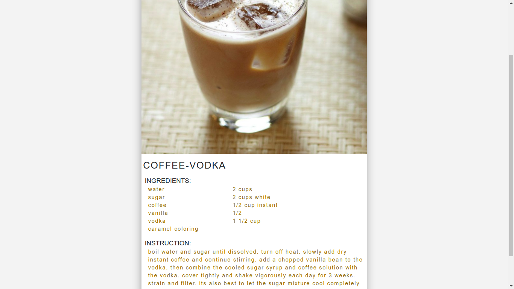

<h1 align="center"><b>Recipe Search :beer:</b></h1> 

**Credits** >> This project was bootstrapped with [Create React App](https://github.com/facebook/create-react-app).  

Website to find Beverages recipe using React and React Router 

<h3 align="center"> <b> https://jasonbch.github.io/business/  </b> </h3>

The user can search recipe using the search bar.
Sample of Specific Recipe looks similar to one shown below :

The website shows all the recipes that contain the keyword.
The feature for multiple keyword is to be implemented.

:beer: Hope You Find Some New Recipes :beers:

